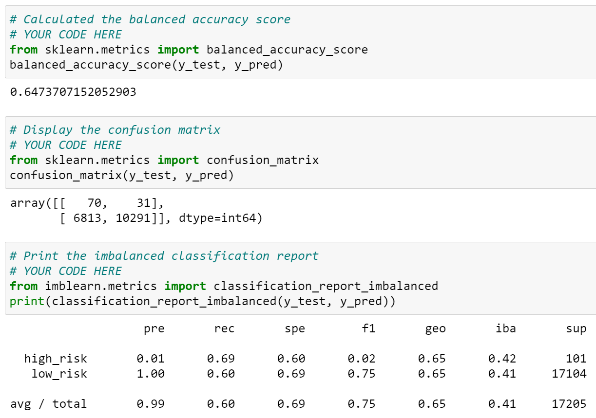
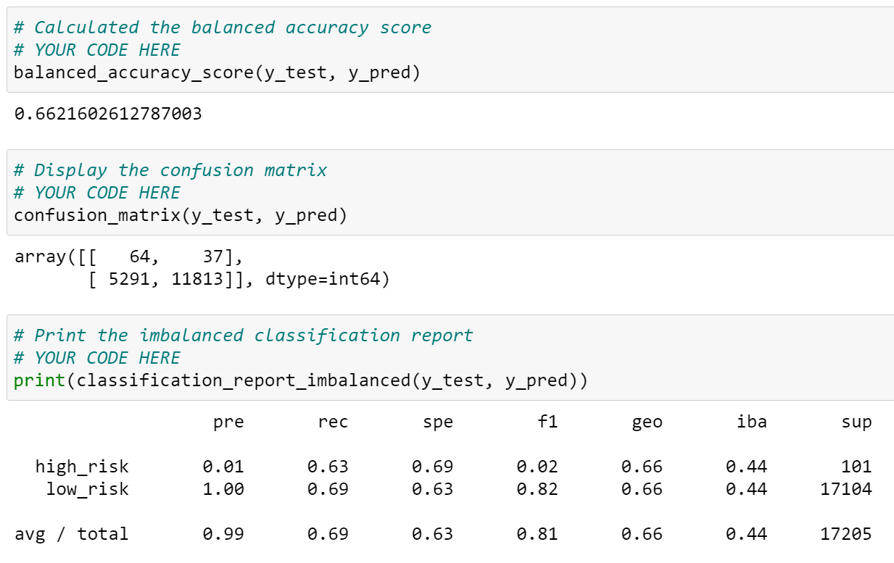
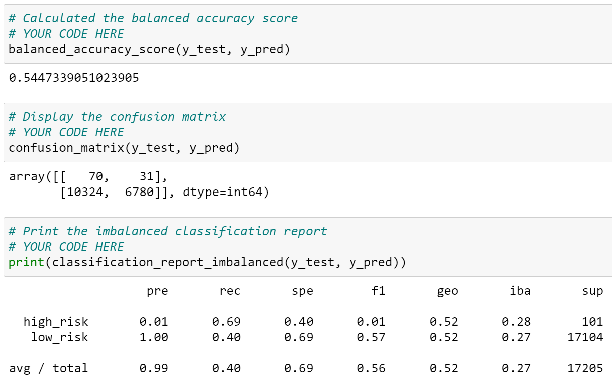
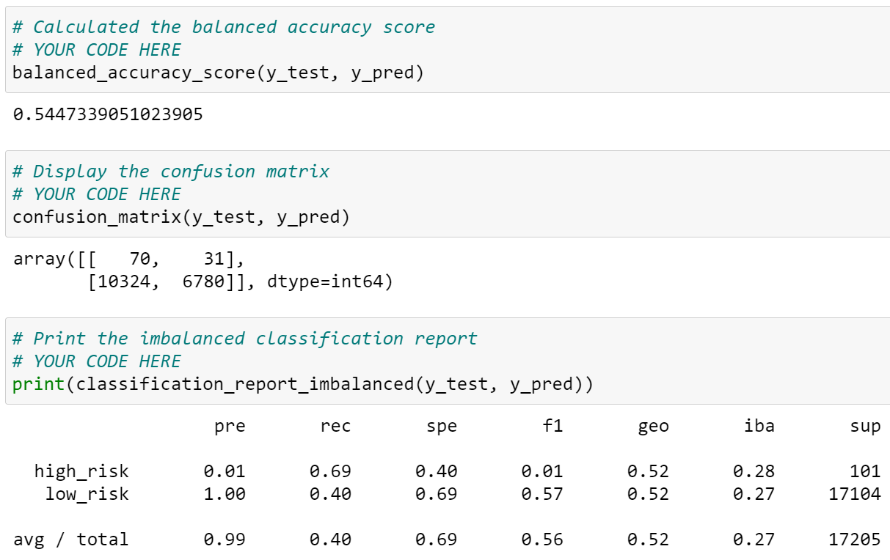
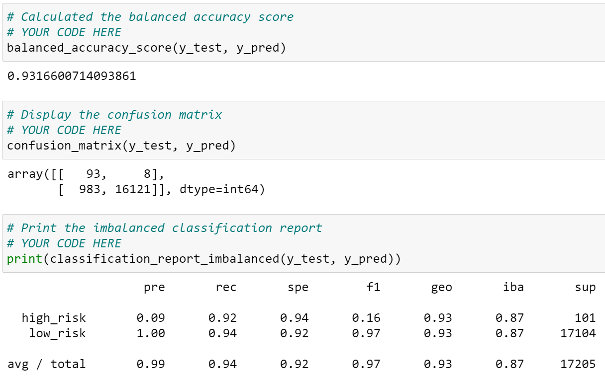

# Credit_Risk_Analysis

## Overview
The purpose of this project is to use multiple techniques to train and evaluate models with unbalanced classes, including imbalanced-learn and scikit-learn libraries to build and evaluate models using resampling to perform credit risk analysis.

## Results
- Random Oversampling:

The Random Oversampling model results in an accuracy score of 0.647. The result shows very low precision (0.01) for high risk but perfect precision (1.00) for low risk. This means that if the model labels a profile as low risk, it should be truly low risk, while if it labels a profile as high risk, there's only 1% chance that it is actually high risk. However, this can be due to the huge difference in support (occurence of event) between high risk and low risk testing data.
The recall for high risk (0.69) is higher than low risk (0.60). This means that the model labelled 69% of truly high risk profiles and 60% of truly low risk profiles.

- SMOTE Oversampling:

The SMOTE Oversampling model results in an accuracy score of 0.662. The result shows very low precision (0.01) for high risk but perfect precision (1.00) for low risk. This means that if the model labels a profile as low risk, it should be truly low risk, while if it labels a profile as high risk, there's only 1% chance that it is actually high risk. However, this can be due to the huge difference in support (occurence of event) between high risk and low risk testing data.
The recall for high risk (0.63) is higher than low risk (0.69). This means that the model labelled 63% of truly high risk profiles and 69% of truly low risk profiles.

- Undersampling:

The Undersampling model results in an accuracy score of 0.545. The result shows very low precision (0.01) for high risk but perfect precision (1.00) for low risk. This means that if the model labels a profile as low risk, it should be truly low risk, while if it labels a profile as high risk, there's only 1% chance that it is actually high risk. However, this can be due to the huge difference in support (occurence of event) between high risk and low risk testing data.
The recall for high risk (0.69) is higher than low risk (0.40). This means that the model labelled 69% of truly high risk profiles and only 40% of truly low risk profiles.

- Combination Sampling:

The Combination Sampling model results in an accuracy score of 0.545. The result shows very low precision (0.01) for high risk but perfect precision (1.00) for low risk. This means that if the model labels a profile as low risk, it should be truly low risk, while if it labels a profile as high risk, there's only 1% chance that it is actually high risk. However, this can be due to the huge difference in support (occurence of event) between high risk and low risk testing data.
The recall for high risk (0.69) is higher than low risk (0.40). This means that the model labelled 69% of truly high risk profiles and only 40% of truly low risk profiles.

- Balanced Random Forest Classifier:

The Balanced Random Forest Classifier model results in an accuracy score of 0.789. The result shows very low precision (0.03) for high risk but perfect precision (1.00) for low risk. This means that if the model labels a profile as low risk, it should be truly low risk, while if it labels a profile as high risk, there's only 3% chance that it is actually high risk. However, this can be due to the huge difference in support (occurence of event) between high risk and low risk testing data.
The recall for low risk (0.87) is higher than high risk (0.70). This means that the model labelled 87% of truly low risk profiles and 70% of truly high risk profiles.

- Easy Ensemble Classifier:

The Easy Ensemble Classifier model results in an accuracy score of 0.932. The result shows very low precision (0.09) for high risk but perfect precision (1.00) for low risk. This means that if the model labels a profile as low risk, it should be truly low risk, while if it labels a profile as high risk, there's only 9% chance that it is actually high risk. However, this can be due to the huge difference in support (occurence of event) between high risk and low risk testing data.
The recall for low risk (0.92) is higher than high risk (0.94). This means that the model labelled 92% of truly low risk profiles and 94% of truly high risk profiles.

## Summary
The ranking of accuracy scores is as follows:
1. 0.932 - Easy Ensemble Classifier
2. 0.789 - Balanced Random Forest Classifier
3. 0.662 - SMOTE Oversampling
4. 0.646 - Random Oversampling
5. 0.545 - Undersampling, Combination Sampling

To summarize, Easy Ensemble Classifier model has the highest accuracy score, as well as the highest precision (0.92) and recall (0.94). Despite the low precision for high risk profiles due to the imbalanced testing data, a high recall (sensitivity) for high risk profiles is desired since it is ideal to capture as many high risk profiles as possible in a business perspective. Therefore, this model is recommended for classification of risk profiles as it works best at classifying both low risk and high risk profiles.
